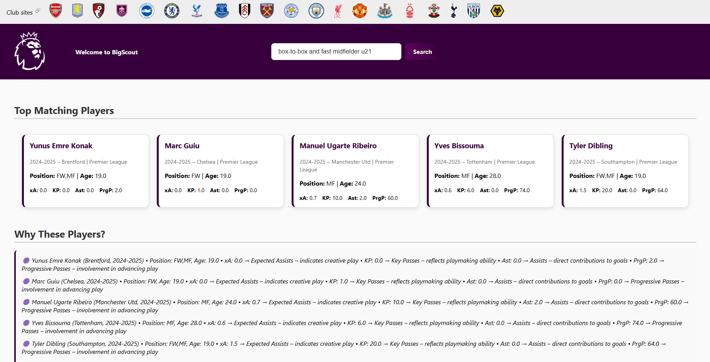
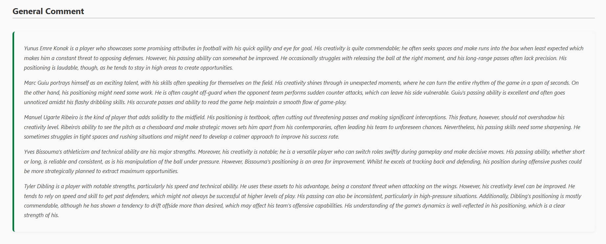

# BigScout

BigScout is an AI-powered football scouting system that leverages big data technologies and OpenAI's GPT models to help users find players that match their tactical and strategic needs. With just a simple prompt (e.g., *"box-to-box midfielder under 21"*), BigScout scans massive datasets, identifies top-performing players, and explains its reasoning — just like a human scout would.

---

## 🧑‍💻 Team Members
- **Member:**   [Eray Acikgoz](https://github.com/ackgz0)
- **Member:**   [Ulas Ucrak](https://github.com/ulasucrak)  
- **Member:**   [Bulent Batikan Sarikaya](https://github.com/Bloheujkleh)

---

## 📸 Demo Screenshots

### User Interface



---

## 🔍 Features

- 🧠 Semantic player search using GPT embeddings
- 📈 Live data ingestion from [FBref](https://fbref.com/)
- ⚙️ Real-time ETL processing with Apache Spark
- 🧰 Distributed architecture using Kafka and Zookeeper
- 🗃️ NoSQL storage using MongoDB
- 🖥️ Minimal Flask frontend for prompt interaction
- 🧪 Detailed player reasoning, stats, and comparisons

---

## ⚙️ Technologies Used

- **Programming Language**: Python  
- **Frameworks / Libraries**: Flask, scikit-learn, OpenAI API  
- **Big Data Tools**: Apache Kafka, Apache Spark, Apache Zookeeper  
- **Database**: MongoDB (visualized with MongoDB Compass)  
- **Web Scraping**: Selenium  
- **Embedding & ML**: OpenAI GPT-based embeddings, pandas, NumPy  

---

## 🚀 Setup Instructions

### 🐳 Prerequisites

- [Docker](https://www.docker.com/)
- [Docker Compose](https://docs.docker.com/compose/)
- [MongoDB Compass (optional for UI)](https://www.mongodb.com/products/compass)
- OpenAI API key (set it in `.env`)

### 🔧 Step-by-step Setup


1. Clone the Repository
```bash
git clone https://github.com/your-username/bigscout.git
cd bigscout
```

2. Start Kafka, Zookeeper, and MongoDB using Docker 
```bash
docker-compose up -d
```

3. Install Python Dependencies 
```bash
pip install -r requirements.txt
```

4. Run the FBref Data Scraper (Kafka Producer) 
```bash
python data_pipeline/kafka_producer.py
```

5. Start Kafka Consumer to Store Data into MongoDB 
```bash
python data_pipeline/kafka_consumer.py
```

6. Start Apache Spark ETL Job to Clean the Data 
```bash
spark-submit data_pipeline/etl-cleaner.py
```

7. Generate Embeddings Using OpenAI API 
```bash
python embedding/embed_players_gpt_batch.py
```

8. Launch the Flask Web Application 
```bash
python app.py
```

9. Open your browser and go to:
```bash
http://localhost:5000
```

### 📦 Data Sources & APIs
FBref.com
Source of raw player statistics and seasonal performance data.

### OpenAI API
Used for embedding player data and generating scout-style reasoning.

### 📋 License
This project is licensed under the MIT License. See the LICENSE file for details.
